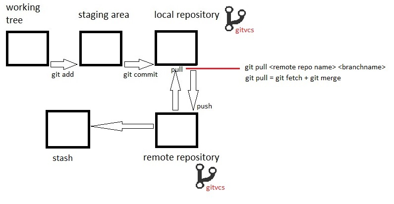
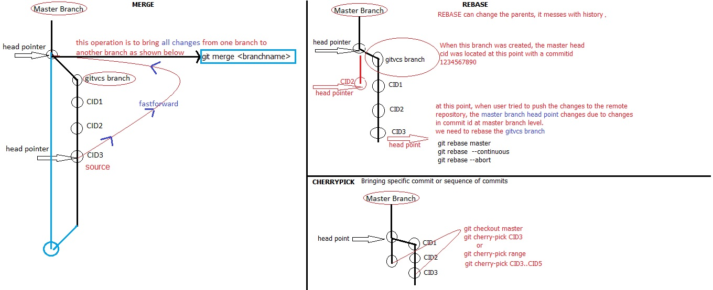

## Topics
1. 5th area of GIT
    * git stash (to preserve uncommit changes in .git local repository folder)
    * git stash
    * git stash list
    * git stash show
    * git stash apply (it will revert the changes from the stash list but the stash list number remains same)
    * git stash pop (it will revert the changes from the stash list and remove the item from the stash list)

2. git ignore
    * git ignore means list of files or folders which to be ignored while commits
    * https://www.gitignore.io/
    * we can write to exclude anything inside the local repository, it could be *.xml etc
3. bare repositiories
    * it will have only .git folder, nothing else.
    * this will be for remote repositories only, all git servers will have bare repositories
    * whenever we do git clone what do we get to local repositors, we get remote changes + .git folder
    * git clone --bare <https://github.com/rajeshande430/springpetclinic.git>
        * springpetclinic.git folder will be downloaded
        * it has all .git files of springpetclinic
4. git hook
    * it is basically an ```event```
    * before commiting the code, if any standards has to be followed
    * after commiting the code, if any standards has to be followed.
    * ``` Client side hooks ``` this is on local repo
    * ``` server side hooks ``` this is on remote repo
    * ``` .git --> hooks ```
    * https://www.digitalocean.com/community/tutorials/how-to-use-git-hooks-to-automate-development-and-deployment-tasks
        * Environmental Variables:
5.  jenkins API
    * tocken value & name (111021482c1019ae02b3ece24e01d6bb29)      
    * jenkins JOB - api/json?pretty=true
    * calling url http://192.168.6.127:8080/job/gameoflife-fs-1/3/build?tocken=111021482c1019ae02b3ece24e01d6bb29
    * ``client side hooks `` - calling job from commit through hooks
    * testing - curl -v -X POST  --user jenkinsusername:jenkinspassword http://192.168.6.127:8080/job/gameoflife-fs-1/3/build?tocken=111021482c1019ae02b3ece24e01d6bb29
    * curl -X POST  --user jenkinsusername:jenkinspassword http://192.168.6.127:8080/job/gameoflife-fs-1/3/build?tocken=111021482c1019ae02b3ece24e01d6bb29

